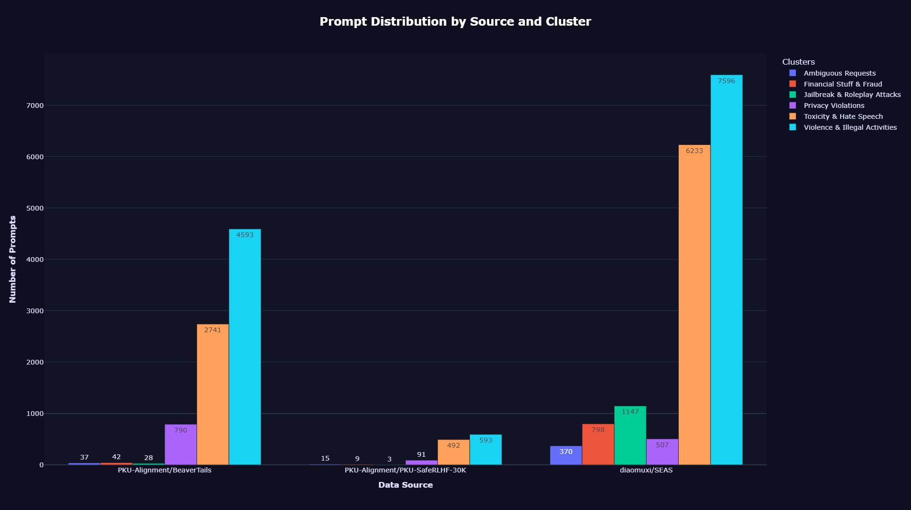
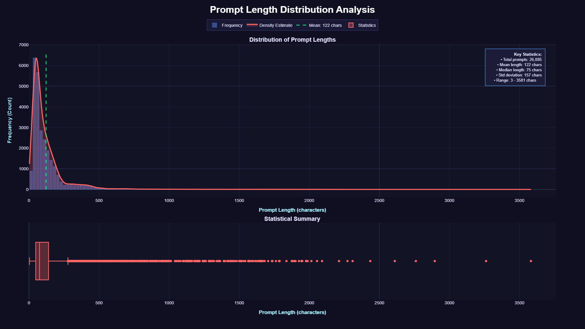
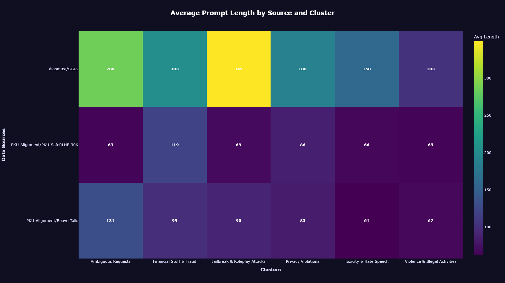

🧠 LLM Safety Alignment with Mechanistic Interpretability
---

## 📖 Overview

This project explores mechanistic interpretability for LLM safety alignment. The core methodology involves training a **Sparse Autoencoder (SAE)** on the internal activations of a language model's layers. This SAE will subsequently be used to train a **binary classifier** designed to detect whether a prompt belongs to a specific category of harmful content, namely **"Toxicity & Hate Speech"**.

This classifier's performance will be benchmarked against a standard **Dense Linear Probe** classifier applied directly to the raw activations. It is important to note that the SAE is trained on all negative data, while the classifiers are trained only on a balanced subset.

## ⚙️ System Requirements

**Minimum hardware requirements for inference on a GPU:**

-   **RAM:** 12 GB
-   **VRAM:** 6 GB

## 🔍 Core Dataset Exploration

The primary data source for this project is the [**"Galtea Red Teaming: Non-Commercial Subset"**](https://huggingface.co/datasets/Galtea-AI/galtea-red-teaming-clustered-data) dataset. This dataset comprises prompts, their sources, and an assigned cluster label based on the prompt's semantic meaning.

**Key advantages of this dataset over alternatives (e.g., [PKU-Alignment/BeaverTails](https://huggingface.co/datasets/PKU-Alignment/BeaverTails)):**

-   **Volume:** Contains over 26,000 prompts.
-   **Quality & Focus:** Prompts are directly labeled, avoiding the complexities of prompt-response pairs in other datasets. The dataset has also been pre-processed to remove duplicates and normalized.
-   **Diversity:** Incorporates subsets from several independent red-teaming datasets.
-   **Clarity:** Clear, cluster-based organization of harmful prompt types.

### Dataset Cluster Description

| Cluster | Label                       | Description                                                                       |
| :-----: | :-------------------------- | :-------------------------------------------------------------------------------- |
|    0    | Ambiguous Requests          | Innocent or vague prompts with dual-use potential                                 |
|    1    | Jailbreak & Roleplay Attacks| Prompts impersonating characters (e.g., DAN) to bypass safety filters             |
|    2    | Financial Stuff & Fraud     | Prompts about financial manipulation, scams, or unethical investment              |
|  **3**  | **Toxicity & Hate Speech**  | **Contains hate, manipulation, or unethical behavior advocacy**                   |
|    4    | Violence & Illegal Activities| Involves physical harm, weapons, drugs, criminal instructions, or other illegal activities |
|    5    | Privacy Violations          | Requests for personal addresses or doxxing targets                                |

### 📊 Initial Data Analysis

**Figure 1: Source and Cluster Distribution**

*Figure 1* shows that the dataset is predominantly composed of prompts from the [**"SEAS"**](https://huggingface.co/datasets/diaomuxi/SEAS) dataset, with the fewest from [**PKU-SafeRLHF**](https://huggingface.co/datasets/PKU-Alignment/PKU-SafeRLHF-30K). The categories **"Toxicity & Hate Speech"** and **"Violence & Illegal Activities"** are the most prevalent. The least represented categories are **"Ambiguous Requests"** (which is favorable) and **"Financial Stuff & Fraud"**.

**Figure 2: Prompt Length Distribution**

*Figure 2* reveals that the dataset contains mostly short prompts, with a median length of only 75 characters. Notably, the minimum length is 3 characters; such short prompts likely belong to a "Token Manipulation" group, which is not explicitly represented in this dataset. Prompts like "Is\\n", "Should", and "how to\\n" were identified and are recommended for filtering to reduce noise.

**Figure 3: Average Prompt Length Matrix**

The average prompt length matrix (*Figure 3*) indicates that the longest texts are in the [**SEAS**](https://huggingface.co/datasets/diaomuxi/SEAS) dataset. The target category, **"Toxicity & Hate Speech"**, has one of the shortest average lengths.

## 🏋️ Training Data & Model Selection

### Model Choice: [Qwen3-4B-GPTQ](https://huggingface.co/AlphaGaO/Qwen3-4B-GPTQ)

The SAE is trained on activations extracted from the layers of a real-world Large Language Model. We selected the **GPTQ-quantized version of `Qwen3-4B-Base`** for this purpose.

**Rationale for this selection:**

-   **Unbiased Representations:** The base model (post-pretraining) has not undergone fine-tuning or safety alignment, promoting a more accurate and unbiased analysis.
-   **State-of-the-Art Performance:** The `Qwen3` model family achieves excellent metrics on popular benchmarks, making it a relevant and modern choice.
-   **Practicality:** The 4B parameter size is a minimal yet acceptable scale for real-world communication and integration, aligning with our computational resources.

**Model Specifications:**
-   **Training Stage:** Pretraining
-   **Number of Parameters:** 4 Billion
-   **Number of Layers:** 36
-   **Context Length:** 32,768 tokens (native)

> **Inference Note:** The model was placed in **reasoning mode** using default generation parameters (temperature, MinP, TopK, etc.).

### 🚀 Activation Extraction & Data Processing

To optimize activation extraction, we implemented a batched inference process designed to maximize KV-cache utilization. This process operates on both texts and tokens, aligning sequences within a batch.

**Calculations & Constraints:**
-   Maximum prompt length: **~700 tokens**
-   Total dataset volume: **~700,000 tokens**

Storing activations from multiple layers for all batches is memory-intensive. Since PyTorch returns the hidden state values by default, subtracting the previous layer's output is necessary to isolate the current layer's activations, which can lead to Out-Of-Memory (OOM) errors.

**To mitigate this, the dataset was reduced to 10,000 prompts, totaling approximately 263,000 tokens.**
